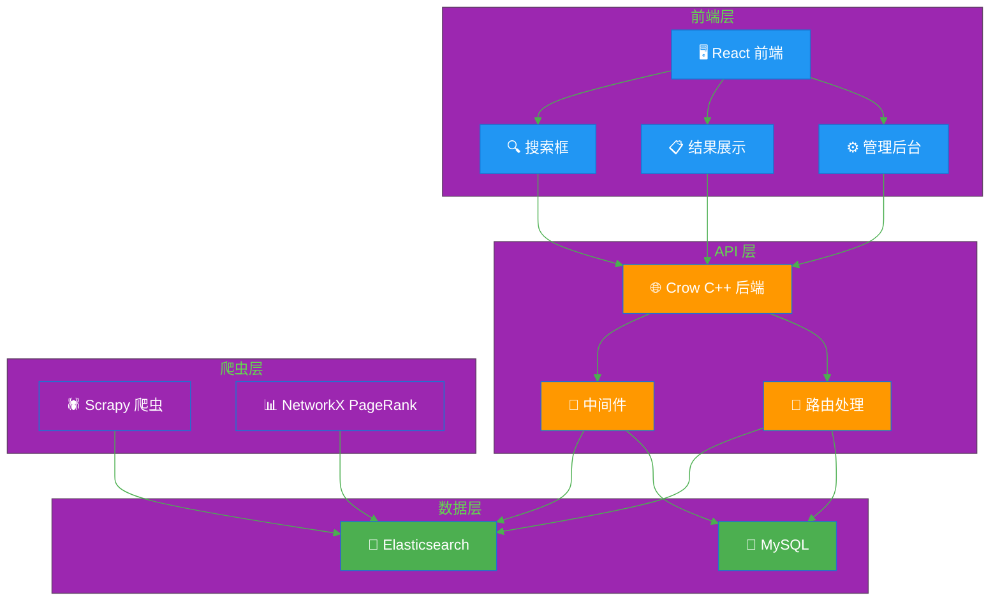
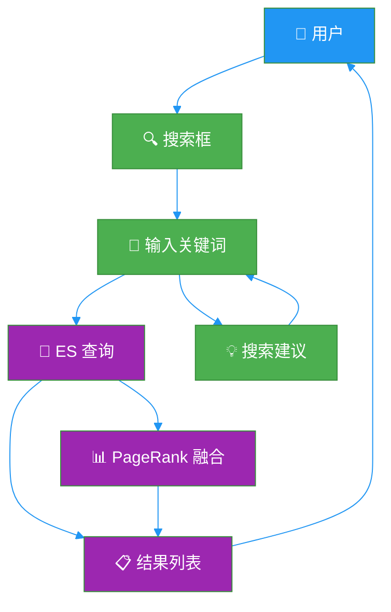
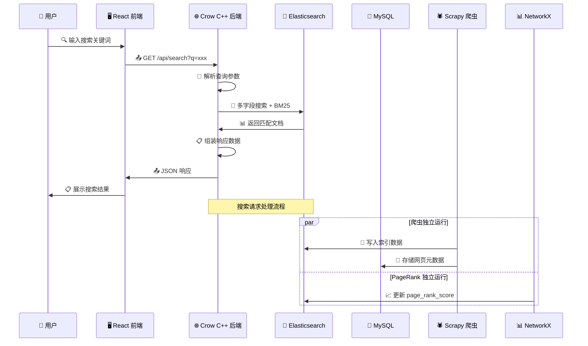
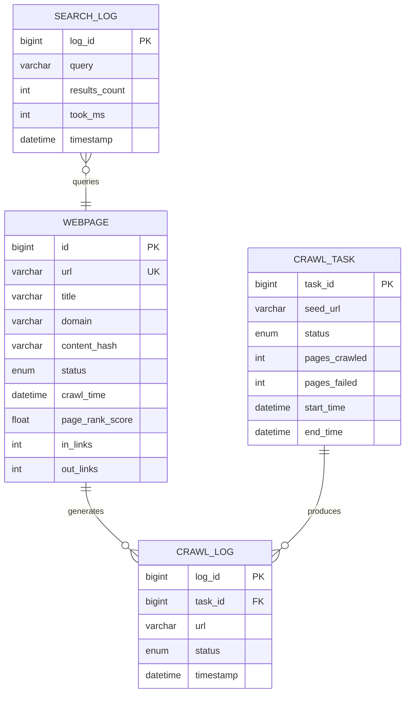
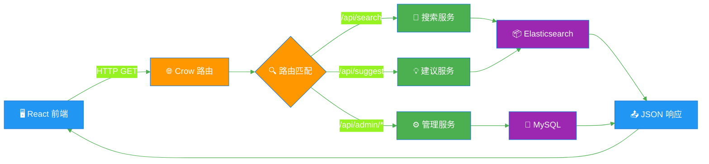

# 🔍 MiniSearch - 分布式网页搜索引擎

**文档版本**: v1.0\
**项目定位**: 面试展示 + AI 协作开发实践\
**文档深度**: 进阶级（重点讲核心难点与亮点）\
**目标读者**: 开发者学习 + 面试官展示 + 开源项目文档

***

## 目录

- [第 1 章：项目概述](#第-1-章项目概述)
- [第 2 章：系统架构设计](#第-2-章系统架构设计)
- [第 3 章：爬虫模块](#第-3-章爬虫模块)
- [第 4 章：搜索引擎模块（核心）](#第-4-章搜索引擎模块核心)
- [第 5 章：PageRank 排序模块](#第-5-章pagerank-排序模块)
- [第 6 章：C++ 后端服务](#第-6-章c-后端服务)
- [第 7 章：前端实现](#第-7-章前端实现)
- [第 8 章：部署与运维](#第-8-章部署与运维)
- [第 9 章：项目亮点与面试指南](#第-9-章项目亮点与面试指南)
- [第 10 章：总结与展望](#第-10-章总结与展望)

***

## 第 1 章：项目概述

### 1.1 项目背景与价值

#### 什么是 MiniSearch？

MiniSearch 是一款基于 C++ 后端 + Elasticsearch 的分布式网页搜索引擎。它能够自动从互联网爬取网页、建立全文索引、计算页面排序，并通过 Web 界面提供搜索服务。整个项目通过 AI Agent 协作完成开发，展示了开发者与 AI 高效协作的能力。

#### 用户需求场景

**场景 1：信息检索**

- 用户想搜索某个技术问题的解决方案
- 输入关键词，系统返回最相关的网页列表
- 结果按相关性和页面重要性排序

**场景 2：知识发现**

- 用户输入模糊关键词，系统提供搜索建议
- 通过"相关搜索"引导用户发现更多内容
- 类似 Google 的搜索体验

**场景 3：内容管理**

- 管理员可以控制爬虫的爬取范围和频率
- 查看索引状态、爬虫状态等系统信息
- 对搜索质量进行监控和调优

#### 竞品对比分析

| 竞品 | 优势 | 劣势 | 我们的差异化 |
|------|------|------|-------------|
| Google | 索引量巨大、算法先进 | 闭源，无法学习内部实现 | 开源、可学习、可定制 |
| Elasticsearch 官方 Demo | ES 功能完整 | 仅有搜索，无爬虫和排序 | 完整搜索引擎闭环 |
| Searx | 隐私搜索、聚合结果 | 依赖其他搜索引擎 API | 自建索引，完全自主 |

#### 技术价值

1. **系统设计能力**: 分布式爬虫、搜索服务、前后端分离架构
2. **C++ 工程实践**: 现代 C++ 开发、CMake 构建、第三方库集成
3. **搜索引擎原理**: 倒排索引、BM25、PageRank、中文分词
4. **AI 协作开发**: 展示如何与 AI Agent 高效协作完成项目

#### 面试价值

- **技术深度**: C++ 后端开发、搜索引擎原理、算法实现
- **工程素养**: 架构设计、技术选型、模块划分
- **AI 协作能力**: 展示与 AI 高效协作而非盲目依赖
- **产品思维**: 需求分析、功能规划、用户体验设计


**图解说明**：数据流转图展示了搜索引擎从数据采集到用户搜索的完整链路。网页数据通过爬虫采集 → 构建索引 → PageRank 排序 → 搜索服务 → 用户获取结果。每个环节都是独立模块，可单独优化。

***

### 1.2 技术栈选型

#### 技术选型原则

1. **务实优先**: 不盲目造轮子，选择成熟可靠的工具
2. **能力展示**: 通过技术选型展示独立判断力
3. **开发效率**: 在有限时间内完成功能完整的系统
4. **面试友好**: 选择面试官认可的技术方案

#### 选型决策过程

本项目的技术选型不是随意选择，而是经过以下思考过程：

| 决策点 | 选项 | 最终选择 | 决策理由 |
|--------|------|----------|----------|
| 主语言 | C++ / Python / Java / Go | **C++** | 展示系统编程能力，面试加分 |
| Web 框架 | Crow / Drogon / cpp-httplib | **Crow** | 类 Flask 风格，开发效率高 |
| 搜索引擎 | 自研 / ES / 混合 | **Elasticsearch** | 务实选择，知道何时用成熟工具 |
| 爬虫 | C++ 自研 / Python Scrapy | **Python Scrapy** | 各取所长，Scrapy 工业级稳定 |
| PageRank | C++ 自研 / Python NetworkX | **Python NetworkX** | 先跑通再优化，避免过度工程 |
| 前端 | React / Vue / 原生 | **React + Ant Design** | 生态最大，面试通用 |
| 数据库 | PostgreSQL / MySQL / MongoDB | **MySQL** | 国内使用率高，安装简单 |
| 缓存 | Redis / 无 | **暂无，后期加** | 先跑通核心流程 |
| 部署 | Docker / 本地 / 混合 | **先本地后 Docker** | 开发效率优先 |

#### 完整技术栈

| 层级 | 技术 | 选型理由 | 替代方案 |
|------|------|----------|----------|
| **后端语言** | C++17 | 系统编程能力、性能优势 | Python、Java、Go |
| **Web 框架** | Crow | 类 Flask、轻量、开发快 | Drogon、cpp-httplib |
| **构建系统** | CMake | C++ 行业标准 | Makefile、Bazel |
| **JSON 库** | nlohmann/json | 单头文件、易用 | rapidjson |
| **HTTP 客户端** | cpp-httplib | 单头文件、轻量 | libcurl |
| **MySQL 驱动** | mysql-connector-c++ | MySQL 官方驱动 | soci |
| **日志库** | spdlog | C++ 最流行日志库 | glog |
| **测试框架** | Google Test | C++ 测试标配 | Catch2 |
| **搜索引擎** | Elasticsearch 7.17 | 工业级全文检索 | 自研倒排索引 |
| **中文分词** | IK Analyzer | 最流行的中文分词器 | jieba |
| **爬虫框架** | Scrapy 2.7 | 工业级 Python 爬虫 | C++ libcurl 自研 |
| **PageRank** | NetworkX | Python 图计算库 | C++ Boost.Graph |
| **前端框架** | React 18 + TypeScript | 生态丰富、类型安全 | Vue.js |
| **UI 组件库** | Ant Design 5 | 企业级组件、美观 | Element Plus |
| **构建工具** | Vite | 前端构建快 | Webpack |
| **状态管理** | Zustand | 轻量简洁 | Redux |
| **数据库** | MySQL 8 | 国内主流、安装简单 | PostgreSQL |
| **部署** | 本地开发 → Docker | 先跑通再容器化 | Kubernetes |

#### 核心技术对比

**Crow vs Drogon**

| 对比项 | Crow | Drogon |
|--------|------|--------|
| 风格 | 类 Flask，路由简洁 | 类 Spring Boot，注解式 |
| 性能 | 中等 | 极高（异步 IO） |
| 学习曲线 | 低 | 高 |
| 文档 | 好 | 一般 |
| 适用场景 | 中小项目、快速开发 | 高性能服务 |

**Elasticsearch vs 自研倒排索引**

| 对比项 | Elasticsearch | 自研倒排索引 |
|--------|---------------|--------------|
| 开发时间 | 1-2 周 | 4-6 周 |
| 稳定性 | 工业级 | 需要大量测试 |
| 功能 | 分词、高亮、建议等开箱即用 | 需要逐个实现 |
| 面试价值 | 展示务实选型能力 | 展示底层算法能力 |
| 适用场景 | 务实交付 | 深入学习 |



**图解说明**：技术架构图展示了系统的四层结构。前端层负责用户交互，API 层使用 C++ Crow 框架处理请求，数据层由 Elasticsearch 和 MySQL 组成，爬虫层使用 Python Scrapy 和 NetworkX 独立运行。各层通过 HTTP API 和数据库协议通信。

***

### 1.3 项目功能总览

#### 核心功能清单

| 功能 | 优先级 | 描述 | 用户价值 |
|------|--------|------|----------|
| **网页爬取** | P0 | 分布式爬取互联网网页 | 数据来源基础 |
| **全文搜索** | P0 | 关键词搜索返回相关网页 | 核心功能 |
| **搜索建议** | P0 | 输入前缀自动补全 | 提升搜索体验 |
| **关键词高亮** | P1 | 搜索结果中高亮关键词 | 快速定位信息 |
| **PageRank 排序** | P1 | 基于链接分析的页面排序 | 提升搜索质量 |
| **相关搜索** | P1 | 推荐相关搜索词 | 引导用户探索 |
| **管理后台** | P2 | 爬虫控制、系统监控 | 运维管理 |

#### MVP（最小可行产品）功能

第一阶段交付的核心功能：

1. 网页爬取（Scrapy 爬虫 → ES 索引）
2. 关键词搜索（用户输入 → 返回结果列表）
3. 搜索建议（输入前缀 → 自动补全）
4. 基础管理界面（查看爬虫和索引状态）



**图解说明**：功能流程图展示了用户搜索的核心流程。用户输入关键词 → 触发搜索建议 → ES 查询 → PageRank 评分融合 → 返回排序后的结果列表。

***

### 📌 本章小结

1. **项目价值**: 构建一个完整的网页搜索引擎，展示系统设计、C++ 工程和 AI 协作能力
2. **技术选型**: C++17 + Crow + Elasticsearch + Scrapy + React + MySQL，务实且展示力强
3. **功能规划**: MVP 聚焦搜索核心链路，后续迭代 PageRank 和管理功能
4. **核心定位**: 展示与 AI 高效协作但又有独立判断力的开发者

### 📌 高频面试问题

**Q1: 为什么选 C++ 而不是 Python？**

> "我选择 C++ 作为后端语言，是因为搜索引擎是计算密集型系统，C++ 在性能上有天然优势。同时，爬虫模块我选择了 Python Scrapy，因为 Scrapy 是工业级爬虫框架，开发效率高。这种混合语言架构体现了我的技术选型判断力——知道什么时候该追求性能，什么时候该追求效率。"

**Q2: 为什么用 Elasticsearch 而不是自研倒排索引？**

> "我评估了自研和 ES 两个方案。自研倒排索引能展示底层算法能力，但开发周期长、稳定性难以保证。选择 ES 是基于务实考量——它提供了成熟的分词、索引、搜索功能，让我能把精力集中在系统架构和搜索质量优化上。如果时间允许，后续可以自研核心模块替换 ES。"

***

## 第 2 章：系统架构设计

### 2.1 整体架构

#### 架构设计原则

1. **模块化**: 爬虫、索引、搜索、前端各自独立，通过 API 通信
2. **混合语言**: C++ 做核心服务，Python 做数据管道，各取所长
3. **渐进式**: 先跑通核心流程，再逐步优化和扩展
4. **可替换**: 每个模块都可以独立替换（如后续用 C++ 自研替换 NetworkX）

#### 系统架构总览

| 层级 | 组件 | 语言 | 职责 |
|------|------|------|------|
| **前端层** | React + Ant Design | TypeScript | 用户交互、搜索界面 |
| **API 层** | Crow Web 框架 | C++17 | 路由、业务逻辑、ES 调用 |
| **搜索层** | Elasticsearch | Java | 倒排索引、BM25、分词 |
| **爬虫层** | Scrapy | Python | 网页爬取、内容提取 |
| **排序层** | NetworkX | Python | PageRank 图计算 |
| **存储层** | MySQL | C | 元数据持久化 |

#### 请求处理流程

```
用户搜索 → React 前端 → Crow C++ 后端 → Elasticsearch → 返回结果
                                              ↑
                         Scrapy 爬虫 ────────→ 索引写入
                         NetworkX PageRank ──→ 评分更新
```



**图解说明**：序列图展示了搜索请求的完整处理流程。用户搜索时，前端调用 C++ 后端 API，后端查询 Elasticsearch 并返回结果。爬虫和 PageRank 作为独立进程运行，分别向 ES 写入索引数据和更新评分。

***

### 2.2 数据库设计

#### 核心实体关系

| 实体 | 主键 | 核心字段 | 说明 |
|------|------|----------|------|
| **WebPage** | url | title, content, domain, crawl_time | 爬取的网页信息 |
| **CrawlTask** | task_id | seed_url, status, start_time | 爬虫任务记录 |
| **CrawlLog** | log_id | task_id, url, status, timestamp | 爬取日志 |
| **SearchLog** | log_id | query, results_count, timestamp | 搜索日志 |

#### 数据库表结构

**WebPage 表（MySQL）**

```sql
CREATE TABLE web_pages (
    id BIGINT AUTO_INCREMENT PRIMARY KEY,
    url VARCHAR(2048) UNIQUE NOT NULL,
    title VARCHAR(500) NOT NULL,
    domain VARCHAR(255) NOT NULL,
    content_hash VARCHAR(64) NOT NULL COMMENT '内容哈希，用于增量更新',
    status ENUM('indexed', 'pending', 'error') DEFAULT 'pending',
    crawl_time DATETIME NOT NULL,
    update_time DATETIME DEFAULT CURRENT_TIMESTAMP ON UPDATE CURRENT_TIMESTAMP,
    page_rank_score FLOAT DEFAULT 0.0,
    in_links INT DEFAULT 0,
    out_links INT DEFAULT 0,
    INDEX idx_domain (domain),
    INDEX idx_status (status),
    INDEX idx_crawl_time (crawl_time),
    INDEX idx_page_rank (page_rank_score)
) ENGINE=InnoDB DEFAULT CHARSET=utf8mb4;
```

**CrawlTask 表**

```sql
CREATE TABLE crawl_tasks (
    task_id BIGINT AUTO_INCREMENT PRIMARY KEY,
    seed_url VARCHAR(2048) NOT NULL,
    status ENUM('running', 'completed', 'failed', 'paused') DEFAULT 'running',
    pages_crawled INT DEFAULT 0,
    pages_failed INT DEFAULT 0,
    start_time DATETIME NOT NULL,
    end_time DATETIME NULL,
    config JSON COMMENT '爬虫配置（深度、频率等）',
    INDEX idx_status (status),
    INDEX idx_start_time (start_time)
) ENGINE=InnoDB DEFAULT CHARSET=utf8mb4;
```

**SearchLog 表**

```sql
CREATE TABLE search_logs (
    log_id BIGINT AUTO_INCREMENT PRIMARY KEY,
    query VARCHAR(500) NOT NULL,
    results_count INT DEFAULT 0,
    took_ms INT DEFAULT 0 COMMENT '查询耗时（毫秒）',
    timestamp DATETIME DEFAULT CURRENT_TIMESTAMP,
    INDEX idx_query (query),
    INDEX idx_timestamp (timestamp)
) ENGINE=InnoDB DEFAULT CHARSET=utf8mb4;
```



**图解说明**：ER 图展示了数据库核心实体及其关系。爬虫任务产生爬取日志，爬取日志关联到网页数据。搜索日志记录用户的搜索行为。网页数据同时存在于 MySQL（元数据）和 Elasticsearch（全文索引）中。

#### 双存储架构

```
                    数据双写架构

    ┌──────────────┐         ┌──────────────┐
    │  MySQL       │         │Elasticsearch │
    │  (元数据)     │         │  (全文索引)    │
    │              │         │              │
    │  • URL       │         │  • 标题       │
    │  • 标题      │         │  • 正文(分词)  │
    │  • 域名      │         │  • Meta描述   │
    │  • 状态      │         │  • PageRank   │
    │  • PageRank  │         │  • 域名       │
    │  • 爬取时间   │         │  • 爬取时间   │
    └──────────────┘         └──────────────┘
         ↑                          ↑
         │                          │
    ┌────┴──────────────────────────┴────┐
    │          Scrapy Pipeline            │
    │     (同时写入 MySQL 和 ES)           │
    └────────────────────────────────────┘
```

**为什么需要双存储？**
- **MySQL**: 存储结构化元数据，支持事务、复杂查询、统计分析
- **Elasticsearch**: 存储全文索引，支持分词搜索、BM25 排序、高亮

***

### 2.3 API 接口设计

#### RESTful API 清单

| 接口 | 方法 | 路径 | 描述 | 参数 |
|------|------|------|------|------|
| 搜索 | GET | /api/search | 关键词搜索 | q, page, size, sort |
| 搜索建议 | GET | /api/suggest | 前缀补全 | prefix, size |
| 相关搜索 | GET | /api/related | 相关搜索词 | q |
| 系统状态 | GET | /api/stats | 索引统计 | - |
| 触发爬虫 | POST | /api/admin/crawl | 启动爬虫任务 | seed_urls |
| 爬虫状态 | GET | /api/admin/crawl/status | 查看爬虫状态 | - |
| 触发 PageRank | POST | /api/admin/pagerank | 启动 PageRank 计算 | - |

#### 核心接口示例

**搜索接口**

```json
// GET /api/search?q=Python教程&page=1&size=10&sort=relevance

// Response
{
    "success": true,
    "data": {
        "total": 12543,
        "page": 1,
        "size": 10,
        "results": [
            {
                "url": "https://example.com/python-tutorial",
                "title": "Python 3 教程 | 菜鸟教程",
                "snippet": "Python 是<em>Python</em>是一门<em>教程</em>...编程语言",
                "domain": "example.com",
                "page_rank": 0.95,
                "crawl_time": "2024-01-15T10:30:00Z"
            }
        ],
        "related_searches": ["Python基础", "Python入门", "Python视频教程"],
        "took_ms": 25
    }
}
```

**搜索建议接口**

```json
// GET /api/suggest?prefix=Pyt&size=5

// Response
{
    "success": true,
    "data": [
        {"text": "Python 教程", "score": 0.95},
        {"text": "Python 基础", "score": 0.90},
        {"text": "Python 入门", "score": 0.85},
        {"text": "Python 爬虫", "score": 0.80},
        {"text": "Python 数据分析", "score": 0.75}
    ]
}
```



**图解说明**：API 路由流程图展示了请求从前端到数据层的完整链路。前端发起 HTTP 请求，Crow 路由匹配后分发到对应服务，服务层查询 Elasticsearch 或 MySQL，最终返回 JSON 响应。

***

### 2.4 安全与性能设计

#### 安全防护策略

| 安全措施 | 实现方式 | 防护目标 |
|----------|----------|----------|
| **输入校验** | Crow 中间件参数检查 | 防止注入攻击 |
| **CORS** | 白名单域名配置 | 防止跨站攻击 |
| **限流** | 令牌桶算法 | 防止 DDoS |
| **SQL 注入** | 参数化查询 | 防止 SQL 注入 |

#### 性能优化策略

| 优化点 | 策略 | 预期效果 |
|--------|------|----------|
| **ES 查询** | 多字段搜索 + BM25 | 搜索相关性提升 |
| **分页** | ES search_after 深度分页 | 避免深度分页性能问题 |
| **连接池** | MySQL 连接池 | 减少连接开销 |
| **异步 IO** | Crow 异步模式 | 提升并发能力 |

***

## 第 3 章：爬虫模块

### 3.1 模块概述

爬虫模块负责从互联网采集网页数据，是搜索引擎的数据来源。本模块使用 Python Scrapy 框架实现，利用其成熟的爬虫能力和丰富的中间件生态。

#### 为什么爬虫用 Python 而不是 C++？

| 对比项 | Python Scrapy | C++ libcurl 自研 |
|--------|---------------|------------------|
| 开发时间 | 1-2 周 | 4-6 周 |
| 稳定性 | 工业级，久经考验 | 需要大量测试 |
| 中间件 | 丰富的内置中间件 | 需要逐个实现 |
| 调试 | 方便，可交互调试 | 较难 |
| 性能 | 足够（IO 密集型瓶颈在网络） | 更高，但爬虫瓶颈不在 CPU |

**结论**：爬虫是 IO 密集型任务，瓶颈在网络延迟而非计算性能。Scrapy 的开发效率远超 C++ 自研，是务实的选择。

### 3.2 爬虫架构

```
                    Scrapy 爬虫架构

┌──────────────────────────────────────────────────────────────┐
│                     Scrapy Engine                            │
│                                                              │
│   ┌────────────┐    ┌────────────┐    ┌────────────┐        │
│   │  Spider 1  │    │  Spider 2  │    │  Spider N  │        │
│   │  (Worker)  │    │  (Worker)  │    │  (Worker)  │        │
│   └─────┬──────┘    └─────┬──────┘    └─────┬──────┘        │
│         │                 │                 │                │
│         └─────────────────┼─────────────────┘                │
│                           │                                  │
│                    ┌──────┴──────┐                           │
│                    │  Scheduler  │  ← URL 优先级队列          │
│                    └──────┬──────┘                           │
│                           │                                  │
│         ┌─────────────────┼─────────────────┐                │
│         ▼                 ▼                 ▼                │
│   ┌───────────┐   ┌───────────┐   ┌───────────┐            │
│   │  Pipeline  │   │  Pipeline  │   │  Pipeline  │            │
│   │  去重      │   │  内容清洗   │   │  ES 写入   │            │
│   └───────────┘   └───────────┘   └───────────┘            │
│                           │                                  │
│                    ┌──────┴──────┐                           │
│                    │  Pipeline   │                           │
│                    │  MySQL 写入  │                           │
│                    └─────────────┘                           │
└──────────────────────────────────────────────────────────────┘
```

### 3.3 项目结构

```
crawler/
├── scrapy.cfg                 # Scrapy 配置
├── minisearch_crawler/
│   ├── __init__.py
│   ├── settings.py            # 爬虫配置
│   ├── items.py               # 数据模型
│   ├── middlewares.py         # 中间件
│   ├── pipelines/
│   │   ├── __init__.py
│   │   ├── deduplicate.py     # URL 去重管道
│   │   ├── content_cleaner.py # 内容清洗管道
│   │   ├── es_pipeline.py     # ES 写入管道
│   │   └── mysql_pipeline.py  # MySQL 写入管道
│   └── spiders/
│       ├── __init__.py
│       ├── general_spider.py  # 通用爬虫
│       └── robots_parser.py   # Robots.txt 解析
├── main.py                    # 入口脚本
└── requirements.txt
```

### 3.4 核心代码设计

**数据模型 (items.py)**

```python
import scrapy

class WebPageItem(scrapy.Item):
    url = scrapy.Field()
    title = scrapy.Field()
    content = scrapy.Field()
    meta_description = scrapy.Field()
    meta_keywords = scrapy.Field()
    domain = scrapy.Field()
    out_links = scrapy.Field()
    crawl_time = scrapy.Field()
```

**通用爬虫 (general_spider.py)**

```python
import scrapy
from minisearch_crawler.items import WebPageItem

class GeneralSpider(scrapy.Spider):
    name = 'general'
    allowed_domains = []

    def __init__(self, seed_urls=None, *args, **kwargs):
        super(GeneralSpider, self).__init__(*args, **kwargs)
        self.start_urls = seed_urls or []

    def parse(self, response):
        item = WebPageItem()
        item['url'] = response.url
        item['title'] = response.css('title::text').get('')
        item['content'] = ' '.join(response.css('p::text').getall())
        item['meta_description'] = response.css(
            'meta[name="description"]::attr(content)'
        ).get('')
        item['meta_keywords'] = response.css(
            'meta[name="keywords"]::attr(content)'
        ).get('')
        item['domain'] = response.url.split('/')[2]
        item['out_links'] = len(response.css('a::attr(href)').getall())
        item['crawl_time'] = response.headers.get('Date', b'').decode()

        yield item

        for href in response.css('a::attr(href)'):
            yield response.follow(href, callback=self.parse)
```

**ES 写入管道 (es_pipeline.py)**

```python
from elasticsearch import Elasticsearch

class ESPipeline:
    def __init__(self, es_host='localhost', es_port=9200):
        self.es = Elasticsearch([f'http://{es_host}:{es_port}'])
        self.index_name = 'web_pages'

    def process_item(self, item, spider):
        doc = {
            'url': item['url'],
            'title': item['title'],
            'content': item['content'],
            'meta_description': item['meta_description'],
            'meta_keywords': item['meta_keywords'],
            'domain': item['domain'],
            'out_links': item['out_links'],
            'crawl_time': item['crawl_time'],
            'page_rank_score': 0.0,
        }
        self.es.index(index=self.index_name, body=doc, id=item['url'])
        return item
```

**爬虫配置 (settings.py)**

```python
BOT_NAME = 'minisearch_crawler'
ROBOTSTXT_OBEY = True
CONCURRENT_REQUESTS = 16
DOWNLOAD_DELAY = 0.5
AUTOTHROTTLE_ENABLED = True
AUTOTHROTTLE_START_DELAY = 0.5
AUTOTHROTTLE_MAX_DELAY = 10.0

ITEM_PIPELINES = {
    'minisearch_crawler.pipelines.deduplicate.DeduplicatePipeline': 100,
    'minisearch_crawler.pipelines.content_cleaner.ContentCleanerPipeline': 200,
    'minisearch_crawler.pipelines.es_pipeline.ESPipeline': 300,
    'minisearch_crawler.pipelines.mysql_pipeline.MySQLPipeline': 400,
}
```

***

## 第 4 章：搜索引擎模块（核心）

### 4.1 模块概述

搜索引擎模块是整个系统的核心，负责接收用户查询、检索索引、计算相关性并返回结果。本模块使用 Elasticsearch 作为搜索引擎，C++ 后端通过 HTTP API 调用 ES。

### 4.2 Elasticsearch 索引设计

#### 索引映射

```json
{
    "settings": {
        "number_of_shards": 5,
        "number_of_replicas": 1,
        "refresh_interval": "5s",
        "analysis": {
            "analyzer": {
                "ik_max_word_analyzer": {
                    "type": "custom",
                    "tokenizer": "ik_max_word",
                    "filter": ["lowercase"]
                },
                "ik_smart_analyzer": {
                    "type": "custom",
                    "tokenizer": "ik_smart",
                    "filter": ["lowercase"]
                }
            }
        }
    },
    "mappings": {
        "properties": {
            "url": { "type": "keyword" },
            "title": {
                "type": "text",
                "analyzer": "ik_max_word_analyzer",
                "search_analyzer": "ik_smart_analyzer",
                "fields": {
                    "keyword": { "type": "keyword", "ignore_above": 256 },
                    "suggest": { "type": "completion" }
                }
            },
            "content": {
                "type": "text",
                "analyzer": "ik_max_word_analyzer",
                "search_analyzer": "ik_smart_analyzer"
            },
            "meta_description": {
                "type": "text",
                "analyzer": "ik_max_word_analyzer"
            },
            "meta_keywords": { "type": "keyword" },
            "domain": { "type": "keyword" },
            "crawl_time": { "type": "date" },
            "page_rank_score": { "type": "float" },
            "in_links": { "type": "integer" },
            "out_links": { "type": "integer" }
        }
    }
}
```

#### 分词策略

| 场景 | 分词器 | 说明 |
|------|--------|------|
| **索引时** | ik_max_word | 最细粒度分词，提高召回率 |
| **搜索时** | ik_smart | 粗粒度分词，提高精确度 |

**示例**：

```
原文: "中华人民共和国国务院"

ik_max_word: "中华人民共和国", "中华人民", "中华", "华人", "人民共和国", "人民", "共和国", "共和", "国", "国务院", "国务", "院"
ik_smart:    "中华人民共和国", "国务院"
```

### 4.3 搜索查询设计

#### 多字段搜索 + PageRank 融合

```json
{
    "query": {
        "function_score": {
            "query": {
                "multi_match": {
                    "query": "Python 教程",
                    "fields": ["title^3", "content", "meta_description^2"],
                    "type": "best_fields",
                    "minimum_should_match": "70%"
                }
            },
            "functions": [
                {
                    "field_value_factor": {
                        "field": "page_rank_score",
                        "factor": 1.2,
                        "modifier": "sqrt",
                        "missing": 1
                    }
                }
            ],
            "score_mode": "multiply",
            "boost_mode": "multiply"
        }
    },
    "highlight": {
        "fields": {
            "title": { "number_of_fragments": 0 },
            "content": {
                "fragment_size": 150,
                "number_of_fragments": 3
            }
        },
        "pre_tags": ["<em>"],
        "post_tags": ["</em>"]
    }
}
```

**评分公式**：

```
最终分数 = BM25分数 × √(1.2 × PageRank分数)
```

| 字段 | 权重 | 理由 |
|------|------|------|
| title | ×3 | 标题最相关，权重最高 |
| meta_description | ×2 | 描述次之 |
| content | ×1 | 正文范围大，默认权重 |

### 4.4 C++ ES 客户端封装

```cpp
// src/search/es_client.hpp
#pragma once
#include <string>
#include <nlohmann/json.hpp>
#include "httplib.h"

class ESClient {
public:
    ESClient(const std::string& host = "localhost", int port = 9200);

    nlohmann::json search(const std::string& index,
                          const std::string& query,
                          int page = 1,
                          int size = 10);

    nlohmann::json suggest(const std::string& index,
                           const std::string& prefix,
                           int size = 5);

    bool index_document(const std::string& index,
                        const std::string& id,
                        const nlohmann::json& doc);

    bool update_page_rank(const std::string& index,
                          const std::string& id,
                          float score);

private:
    std::string host_;
    int port_;
    std::unique_ptr<httplib::Client> client_;
};
```

```cpp
// src/search/es_client.cpp
#include "es_client.hpp"
#include <spdlog/spdlog.h>

ESClient::ESClient(const std::string& host, int port)
    : host_(host), port_(port),
      client_(std::make_unique<httplib::Client>(host, port)) {}

nlohmann::json ESClient::search(const std::string& index,
                                 const std::string& query,
                                 int page, int size) {
    nlohmann::json body = {
        {"query", {
            {"function_score", {
                {"query", {
                    {"multi_match", {
                        {"query", query},
                        {"fields", {"title^3", "content", "meta_description^2"}},
                        {"type", "best_fields"}
                    }}
                }},
                {"functions", {
                    {{"field_value_factor", {
                        {"field", "page_rank_score"},
                        {"factor", 1.2},
                        {"modifier", "sqrt"},
                        {"missing", 1}
                    }}}
                }},
                {"score_mode", "multiply"},
                {"boost_mode", "multiply"}
            }}
        }},
        {"from", (page - 1) * size},
        {"size", size},
        {"highlight", {
            {"fields", {
                {"title", {{"number_of_fragments", 0}}},
                {"content", {{"fragment_size", 150}, {"number_of_fragments", 3}}}
            }},
            {"pre_tags", {"<em>"}},
            {"post_tags", {"</em>"}}
        }}
    };

    auto res = client_->Post(
        "/" + index + "/_search",
        body.dump(),
        "application/json"
    );

    if (res && res->status == 200) {
        return nlohmann::json::parse(res->body);
    }

    spdlog::error("ES search failed: {}", res ? std::to_string(res->status) : "connection error");
    return {};
}
```

***

## 第 5 章：PageRank 排序模块

### 5.1 模块概述

PageRank 模块负责计算网页的重要性评分，是搜索结果排序的关键因素。本模块使用 Python NetworkX 实现图构建和 PageRank 计算，计算结果更新到 Elasticsearch。

#### 为什么 PageRank 用 Python 而不是 C++？

| 对比项 | Python NetworkX | C++ Boost.Graph |
|--------|-----------------|-----------------|
| 开发时间 | 2-3 天 | 1-2 周 |
| 代码量 | ~100 行 | ~500 行 |
| 调试 | 方便 | 较难 |
| 性能 | 50万页面足够 | 更高 |

**结论**：PageRank 是离线计算任务，不需要实时响应。NetworkX 的开发效率远高于 C++，50万页面规模下性能完全够用。

### 5.2 PageRank 算法原理

**核心思想**：一个网页的重要性取决于指向它的网页的数量和质量。

```
PR(A) = (1 - d) / N + d × Σ [PR(Ti) / C(Ti)]
```

| 符号 | 含义 |
|------|------|
| PR(A) | 页面 A 的 PageRank 值 |
| d | 阻尼系数（通常 0.85） |
| N | 总页面数 |
| Ti | 指向页面 A 的所有页面 |
| C(Ti) | 页面 Ti 的出链数量 |

**直观理解**：

```
        ┌──────────┐
        │  Page A  │ (PR=0.3)
        │  出链: 2  │
        └──┬───┬───┘
           │   │
     0.15  │   │  0.15
           ▼   ▼
    ┌──────┐ ┌──────┐
    │Page B│ │Page C│
    └──────┘ └──────┘

Page A 的 PR 值平均分配给 B 和 C
每个获得 0.3 / 2 = 0.15
```

### 5.3 项目结构

```
pagerank/
├── __init__.py
├── graph_builder.py       # 从 MySQL 构建链接图
├── pagerank_calculator.py # PageRank 计算
├── es_updater.py          # 更新 ES 中的 page_rank_score
├── main.py                # 入口脚本
└── requirements.txt
```

### 5.4 核心代码设计

**图构建 (graph_builder.py)**

```python
import networkx as nx
import mysql.connector

class GraphBuilder:
    def __init__(self, mysql_config):
        self.mysql_config = mysql_config

    def build(self):
        G = nx.DiGraph()

        conn = mysql.connector.connect(**self.mysql_config)
        cursor = conn.cursor(dictionary=True)

        cursor.execute("SELECT url, out_links FROM web_pages WHERE status='indexed'")
        for row in cursor:
            G.add_node(row['url'])

        cursor.execute("SELECT source_url, target_url FROM page_links")
        for row in cursor:
            G.add_edge(row['source_url'], row['target_url'])

        conn.close()
        return G
```

**PageRank 计算 (pagerank_calculator.py)**

```python
import networkx as nx

class PageRankCalculator:
    def __init__(self, damping=0.85, max_iter=100, tol=1e-6):
        self.damping = damping
        self.max_iter = max_iter
        self.tol = tol

    def calculate(self, graph):
        pr = nx.pagerank(
            graph,
            alpha=self.damping,
            max_iter=self.max_iter,
            tol=self.tol
        )
        return pr
```

**ES 更新 (es_updater.py)**

```python
from elasticsearch import Elasticsearch

class ESUpdater:
    def __init__(self, es_host='localhost', es_port=9200):
        self.es = Elasticsearch([f'http://{es_host}:{es_port}'])

    def update(self, pagerank_scores):
        for url, score in pagerank_scores.items():
            self.es.update(
                index='web_pages',
                id=url,
                body={'doc': {'page_rank_score': score}}
            )
```

**入口脚本 (main.py)**

```python
from graph_builder import GraphBuilder
from pagerank_calculator import PageRankCalculator
from es_updater import ESUpdater

def main():
    mysql_config = {
        'host': 'localhost',
        'user': 'root',
        'password': 'password',
        'database': 'minisearch'
    }

    builder = GraphBuilder(mysql_config)
    graph = builder.build()
    print(f"Graph built: {graph.number_of_nodes()} nodes, {graph.number_of_edges()} edges")

    calculator = PageRankCalculator()
    scores = calculator.calculate(graph)
    print(f"PageRank calculated: {len(scores)} pages")

    updater = ESUpdater()
    updater.update(scores)
    print("PageRank scores updated in Elasticsearch")

if __name__ == '__main__':
    main()
```

***

## 第 6 章：C++ 后端服务

### 6.1 模块概述

C++ 后端服务是整个系统的 API 网关，负责接收前端请求、调用 Elasticsearch 和 MySQL、返回结构化数据。使用 Crow 框架实现 RESTful API。

### 6.2 项目结构

```
backend/
├── CMakeLists.txt
├── include/
│   ├── api/
│   │   ├── search_handler.hpp    # 搜索路由处理
│   │   ├── suggest_handler.hpp   # 建议路由处理
│   │   └── admin_handler.hpp     # 管理路由处理
│   ├── search/
│   │   ├── es_client.hpp         # ES 客户端封装
│   │   └── query_builder.hpp     # 查询构建器
│   ├── storage/
│   │   ├── mysql_client.hpp      # MySQL 客户端封装
│   │   └── connection_pool.hpp   # MySQL 连接池
│   ├── models/
│   │   ├── search_result.hpp     # 搜索结果模型
│   │   └── page_info.hpp         # 页面信息模型
│   └── utils/
│       ├── config.hpp            # 配置管理
│       ├── logger.hpp            # 日志工具
│       └── json_utils.hpp        # JSON 工具
├── src/
│   ├── main.cpp                  # 应用入口
│   ├── api/
│   │   ├── search_handler.cpp
│   │   ├── suggest_handler.cpp
│   │   └── admin_handler.cpp
│   ├── search/
│   │   ├── es_client.cpp
│   │   └── query_builder.cpp
│   ├── storage/
│   │   ├── mysql_client.cpp
│   │   └── connection_pool.cpp
│   └── utils/
│       ├── config.cpp
│       └── logger.cpp
├── tests/
│   ├── CMakeLists.txt
│   ├── test_es_client.cpp
│   └── test_search_handler.cpp
├── config/
│   └── config.json               # 配置文件
└── Dockerfile
```

### 6.3 核心代码设计

**应用入口 (main.cpp)**

```cpp
#include <crow.h>
#include "api/search_handler.hpp"
#include "api/suggest_handler.hpp"
#include "api/admin_handler.hpp"
#include "search/es_client.hpp"
#include "storage/mysql_client.hpp"
#include "utils/config.hpp"
#include "utils/logger.hpp"

int main() {
    utils::Logger::init();
    auto config = utils::Config::load("config/config.json");

    search::ESClient es_client(config["es"]["host"], config["es"]["port"]);
    storage::MySQLClient mysql_client(config["mysql"]);

    crow::SimpleApp app;

    api::SearchHandler search_handler(es_client);
    api::SuggestHandler suggest_handler(es_client);
    api::AdminHandler admin_handler(es_client, mysql_client);

    search_handler.register_routes(app);
    suggest_handler.register_routes(app);
    admin_handler.register_routes(app);

    spdlog::info("MiniSearch backend starting on port {}", config["server"]["port"]);
    app.port(config["server"]["port"]).multithreaded().run();

    return 0;
}
```

**搜索路由处理 (search_handler.hpp)**

```cpp
#pragma once
#include <crow.h>
#include "search/es_client.hpp"

namespace api {

class SearchHandler {
public:
    explicit SearchHandler(search::ESClient& es_client);

    void register_routes(crow::SimpleApp& app);

private:
    search::ESClient& es_client_;

    crow::response handle_search(const crow::request& req);
};

}
```

```cpp
// src/api/search_handler.cpp
#include "api/search_handler.hpp"
#include <nlohmann/json.hpp>
#include <spdlog/spdlog.h>

namespace api {

SearchHandler::SearchHandler(search::ESClient& es_client)
    : es_client_(es_client) {}

void SearchHandler::register_routes(crow::SimpleApp& app) {
    CROW_ROUTE(app, "/api/search").methods("GET"_method)
    ([this](const crow::request& req) {
        return handle_search(req);
    });
}

crow::response SearchHandler::handle_search(const crow::request& req) {
    auto query = req.url_params.get("q");
    if (!query || strlen(query) == 0) {
        return crow::response(400, "{\"success\":false,\"error\":\"Missing query parameter 'q'\"}");
    }

    int page = 1;
    int size = 10;
    if (auto p = req.url_params.get("page")) page = std::stoi(p);
    if (auto s = req.url_params.get("size")) size = std::stoi(s);

    try {
        auto es_result = es_client_.search("web_pages", query, page, size);

        nlohmann::json response;
        response["success"] = true;
        response["data"]["total"] = es_result["hits"]["total"]["value"];
        response["data"]["page"] = page;
        response["data"]["size"] = size;

        auto results = nlohmann::json::array();
        for (auto& hit : es_result["hits"]["hits"]) {
            nlohmann::json item;
            item["url"] = hit["_source"]["url"];
            item["title"] = hit["_source"]["title"];
            item["domain"] = hit["_source"]["domain"];
            item["page_rank"] = hit["_source"]["page_rank_score"];

            if (hit.contains("highlight") && hit["highlight"].contains("content")) {
                item["snippet"] = hit["highlight"]["content"][0];
            } else {
                std::string content = hit["_source"]["content"];
                item["snippet"] = content.substr(0, std::min(content.size(), size_t(200)));
            }

            results.push_back(item);
        }
        response["data"]["results"] = results;

        return crow::response(response.dump());
    } catch (const std::exception& e) {
        spdlog::error("Search failed: {}", e.what());
        return crow::response(500, "{\"success\":false,\"error\":\"Internal server error\"}");
    }
}

}
```

**CMakeLists.txt**

```cmake
cmake_minimum_required(VERSION 3.20)
project(MiniSearch VERSION 1.0 LANGUAGES CXX)

set(CMAKE_CXX_STANDARD 17)
set(CMAKE_CXX_STANDARD_REQUIRED ON)

find_package(Threads REQUIRED)

include(FetchContent)

FetchContent_Declare(
    crow
    GIT_REPOSITORY https://github.com/CrowCpp/Crow.git
    GIT_TAG v1.0
)
FetchContent_MakeAvailable(crow)

add_executable(minisearch
    src/main.cpp
    src/api/search_handler.cpp
    src/api/suggest_handler.cpp
    src/api/admin_handler.cpp
    src/search/es_client.cpp
    src/search/query_builder.cpp
    src/storage/mysql_client.cpp
    src/storage/connection_pool.cpp
    src/utils/config.cpp
    src/utils/logger.cpp
)

target_link_libraries(minisearch
    PRIVATE
    Crow::Crow
    Threads::Threads
    mysqlcppconn
    spdlog::spdlog
)
```

### 6.4 配置文件

```json
// config/config.json
{
    "server": {
        "port": 8080
    },
    "es": {
        "host": "localhost",
        "port": 9200,
        "index": "web_pages"
    },
    "mysql": {
        "host": "localhost",
        "port": 3306,
        "user": "root",
        "password": "password",
        "database": "minisearch"
    },
    "crawler": {
        "script_path": "../crawler/main.py"
    },
    "pagerank": {
        "script_path": "../pagerank/main.py"
    }
}
```

***

## 第 7 章：前端实现

### 7.1 模块概述

前端提供搜索界面和管理后台，使用 React + TypeScript + Ant Design 实现。

### 7.2 项目结构

```
frontend/
├── public/
│   └── index.html
├── src/
│   ├── index.tsx
│   ├── App.tsx
│   ├── components/
│   │   ├── SearchBox/
│   │   │   ├── SearchBox.tsx
│   │   │   ├── SearchInput.tsx
│   │   │   └── SuggestDropdown.tsx
│   │   ├── SearchResult/
│   │   │   ├── SearchResult.tsx
│   │   │   ├── ResultItem.tsx
│   │   │   └── ResultSnippet.tsx
│   │   ├── Pagination/
│   │   │   └── Pagination.tsx
│   │   └── RelatedSearches/
│   │       └── RelatedSearches.tsx
│   ├── pages/
│   │   ├── HomePage.tsx
│   │   └── AdminPage.tsx
│   ├── hooks/
│   │   ├── useSearch.ts
│   │   ├── useSuggest.ts
│   │   └── useDebounce.ts
│   ├── services/
│   │   └── api.ts
│   ├── stores/
│   │   └── searchStore.ts
│   ├── types/
│   │   └── search.ts
│   └── styles/
│       └── global.css
├── package.json
├── tsconfig.json
└── vite.config.ts
```

### 7.3 核心代码设计

**API 调用封装 (api.ts)**

```typescript
import axios from 'axios';

const API_BASE = 'http://localhost:8080/api';

export interface SearchParams {
    q: string;
    page?: number;
    size?: number;
    sort?: string;
}

export interface SearchResult {
    url: string;
    title: string;
    snippet: string;
    domain: string;
    page_rank: number;
    crawl_time: string;
}

export interface SearchResponse {
    success: boolean;
    data: {
        total: number;
        page: number;
        size: number;
        results: SearchResult[];
        related_searches: string[];
        took_ms: number;
    };
}

export async function search(params: SearchParams): Promise<SearchResponse> {
    const { data } = await axios.get(`${API_BASE}/search`, { params });
    return data;
}

export async function suggest(prefix: string, size = 5) {
    const { data } = await axios.get(`${API_BASE}/suggest`, { params: { prefix, size } });
    return data;
}
```

**搜索 Hook (useSearch.ts)**

```typescript
import { useState } from 'react';
import { search, SearchParams, SearchResponse } from '../services/api';

export function useSearch() {
    const [loading, setLoading] = useState(false);
    const [data, setData] = useState<SearchResponse | null>(null);
    const [error, setError] = useState<string | null>(null);

    const doSearch = async (params: SearchParams) => {
        setLoading(true);
        setError(null);
        try {
            const result = await search(params);
            setData(result);
        } catch (e) {
            setError('搜索失败，请重试');
        } finally {
            setLoading(false);
        }
    };

    return { loading, data, error, doSearch };
}
```

**搜索页面 (HomePage.tsx)**

```tsx
import React, { useState } from 'react';
import { Input, Button, Spin, Pagination } from 'antd';
import { SearchOutlined } from '@ant-design/icons';
import { useSearch } from '../hooks/useSearch';
import { useSuggest } from '../hooks/useSuggest';
import ResultItem from '../components/SearchResult/ResultItem';
import RelatedSearches from '../components/RelatedSearches/RelatedSearches';

const { Search } = Input;

export default function HomePage() {
    const [query, setQuery] = useState('');
    const [page, setPage] = useState(1);
    const { loading, data, error, doSearch } = useSearch();

    const handleSearch = (value: string) => {
        if (value.trim()) {
            setQuery(value);
            setPage(1);
            doSearch({ q: value, page: 1, size: 10 });
        }
    };

    const handlePageChange = (newPage: number) => {
        setPage(newPage);
        doSearch({ q: query, page: newPage, size: 10 });
    };

    return (
        <div style={{ maxWidth: 800, margin: '0 auto', padding: '40px 20px' }}>
            <h1 style={{ textAlign: 'center', marginBottom: 40 }}>
                🔍 MiniSearch
            </h1>

            <Search
                placeholder="输入关键词搜索..."
                enterButton={<Button icon={<SearchOutlined />}>搜索</Button>}
                size="large"
                onSearch={handleSearch}
                loading={loading}
            />

            {loading && <Spin style={{ display: 'block', margin: '40px auto' }} />}

            {error && <p style={{ color: 'red', textAlign: 'center' }}>{error}</p>}

            {data && (
                <>
                    <p style={{ color: '#666', marginTop: 20 }}>
                        找到约 {data.data.total} 条结果（用时 {data.data.took_ms}ms）
                    </p>

                    {data.data.results.map((item) => (
                        <ResultItem key={item.url} item={item} />
                    ))}

                    <Pagination
                        current={page}
                        total={data.data.total}
                        pageSize={10}
                        onChange={handlePageChange}
                        style={{ textAlign: 'center', marginTop: 30 }}
                    />

                    <RelatedSearches searches={data.data.related_searches} />
                </>
            )}
        </div>
    );
}
```

***

## 第 8 章：部署与运维

### 8.1 开发环境搭建

#### 混合开发方案：Windows 前端 + Ubuntu 后端

本项目采用**前后端分离的混合开发模式**：在 Windows 上编写所有代码和开发前端，在 Ubuntu 虚拟机上编译运行后端服务。这也是真实工作中最常见的开发模式。

**为什么这样分工？**

| 考量 | 说明 |
|------|------|
| **Crow 框架** | Crow 是 Linux 原生 C++ Web 框架，Windows 上有兼容性问题，必须在 Linux 编译运行 |
| **C++ 工具链** | Ubuntu 上 `apt install` 一条命令搞定，Windows 需装 20GB+ 的 Visual Studio |
| **前端体验** | 浏览器在 Windows，Node.js 已装好，Vite 热更新更流畅 |
| **面试价值** | 面试官看到 Linux 下开发 C++ 后端，会认可服务端开发能力 |
| **生产一致性** | 搜索引擎是服务端项目，生产环境几乎 100% 是 Linux |

**开发架构图**

```
🪟 Windows (Trae IDE)                    🐧 Ubuntu 20.04 VM
┌─────────────────────────┐             ┌──────────────────────────┐
│                         │             │                          │
│  编写所有代码             │             │  C++ 后端 (Crow)          │
│  (C++ / Python / React) │  ── SSH ──→ │  :8080                   │
│                         │             │                          │
│  React 前端开发          │             │  Elasticsearch           │
│  npm run dev            │             │  :9200                   │
│  localhost:5173         │             │                          │
│         │               │             │  MySQL 8.0               │
│         └── /api/* ─────┼── HTTP ──→  │  :3306                   │
│             (Vite Proxy)│             │                          │
│                         │             │  Python 爬虫 / PageRank   │
│  浏览器预览 & DevTools   │             │                          │
│                         │             │                          │
└─────────────────────────┘             └──────────────────────────┘
```

**前端连接 Ubuntu 后端（Vite 代理配置）**

```typescript
// frontend/vite.config.ts
import { defineConfig } from 'vite'
import react from '@vitejs/plugin-react'

export default defineConfig({
  plugins: [react()],
  server: {
    proxy: {
      '/api': {
        target: 'http://<Ubuntu-IP>:8080',
        changeOrigin: true,
      }
    }
  }
})
```

#### 环境要求

**🐧 Ubuntu 20.04（后端服务）**

| 组件 | 版本要求 | 用途 | 安装方式 |
|------|----------|------|----------|
| **GCC** | 9+ | 编译 C++ 后端 | `sudo apt install g++` |
| **CMake** | 3.20+ | C++ 构建 | `sudo apt install cmake` |
| **Python** | 3.9+ | 爬虫 + PageRank | `sudo apt install python3.9 python3-pip` |
| **Elasticsearch** | 7.17 | 搜索引擎 | 官网下载解压 |
| **IK 分词器** | 7.17 | 中文分词插件 | ES 插件安装 |
| **MySQL** | 8.0 | 元数据存储 | `sudo apt install mysql-server` |

**🪟 Windows（前端开发）**

| 组件 | 版本要求 | 用途 | 安装方式 |
|------|----------|------|----------|
| **Node.js** | 18+ | 前端构建 | 官网下载（已安装 ✅） |
| **npm** | 最新 | 包管理 | 随 Node.js 安装（已安装 ✅） |
| **Trae IDE** | 最新 | 代码编辑 + AI 协作 | 官网下载（已安装 ✅） |
| **SSH 客户端** | 任意 | 连接 Ubuntu | Windows 自带（已安装 ✅） |

#### Ubuntu 环境一键安装

```bash
# 1. 更新系统
sudo apt update && sudo apt upgrade -y

# 2. C++ 工具链
sudo apt install -y g++ cmake make

# 3. Python 3.9+（Ubuntu 20.04 自带 3.8，需加 PPA 升级）
sudo apt install -y software-properties-common
sudo add-apt-repository -y ppa:deadsnakes/ppa
sudo apt install -y python3.9 python3.9-venv python3.9-dev python3-pip

# 4. MySQL 8.0
sudo apt install -y mysql-server
sudo mysql_secure_installation

# 5. Elasticsearch 7.17（需手动下载）
wget https://artifacts.elastic.co/downloads/elasticsearch/elasticsearch-7.17.0-linux-x86_64.tar.gz
tar -xzf elasticsearch-7.17.0-linux-x86_64.tar.gz
cd elasticsearch-7.17.0

# 6. IK 分词插件
./bin/elasticsearch-plugin install https://github.com/medcl/elasticsearch-analysis-ik/releases/download/v7.17.0/elasticsearch-analysis-ik-7.17.0.zip

# 7. 启动 ES
./bin/elasticsearch -d

# 8. 初始化数据库
mysql -u root -p < scripts/init_db.sql

# 9. 初始化 ES 索引
python3.9 scripts/init_es_index.py
```

#### 日常开发流程

```bash
# === Ubuntu 端：启动后端服务 ===

# 启动 Elasticsearch
cd ~/elasticsearch-7.17.0 && ./bin/elasticsearch -d

# 启动 MySQL（通常开机自启）
sudo systemctl start mysql

# 编译并启动 C++ 后端
cd backend/build && cmake .. && make -j4 && ./minisearch

# 启动爬虫（需要时）
cd crawler && python3.9 main.py --seed_urls "https://news.ycombinator.com/"

# 计算 PageRank（需要时）
cd pagerank && python3.9 main.py

# === Windows 端：启动前端 ===

cd frontend
npm install
npm run dev
# 浏览器打开 http://localhost:5173
# API 请求自动代理到 Ubuntu 后端
```

#### 代码同步方式

在 Windows 上用 Trae 编写代码，通过以下方式同步到 Ubuntu：

| 方式 | 说明 | 适用场景 |
|------|------|----------|
| **VSCode Remote-SSH** | 直接在 Trae 中远程编辑 Ubuntu 文件 | 日常开发（推荐） |
| **SCP/SFTP** | 手动上传文件 | 偶尔同步 |
| **Git** | push 到仓库，Ubuntu 端 pull | 版本管理 |

### 8.2 Docker 部署（后期）

```yaml
# docker-compose.yml
version: '3.8'

services:
  elasticsearch:
    image: elasticsearch:7.17.0
    environment:
      - discovery.type=single-node
      - "ES_JAVA_OPTS=-Xms512m -Xmx512m"
    ports:
      - "9200:9200"

  mysql:
    image: mysql:8.0
    environment:
      MYSQL_ROOT_PASSWORD: password
      MYSQL_DATABASE: minisearch
    ports:
      - "3306:3306"

  backend:
    build: ./backend
    ports:
      - "8080:8080"
    depends_on:
      - elasticsearch
      - mysql

  frontend:
    build: ./frontend
    ports:
      - "3000:3000"
    depends_on:
      - backend
```

### 8.3 监控与日志

| 组件 | 日志方式 | 说明 |
|------|----------|------|
| **C++ 后端** | spdlog → 文件 | 搜索请求、错误日志 |
| **Scrapy 爬虫** | Python logging → 文件 | 爬取进度、错误日志 |
| **Elasticsearch** | ES 内置日志 | 索引状态、查询性能 |
| **MySQL** | 慢查询日志 | 查询性能监控 |

***

## 第 9 章：项目亮点与面试指南

### 9.1 技术亮点

| 亮点 | 说明 | 面试展示方式 |
|------|------|--------------|
| **混合语言架构** | C++ 后端 + Python 数据管道 | 展示技术选型判断力 |
| **C++ 现代工程** | CMake + C++17 + 第三方库集成 | 展示 C++ 工程能力 |
| **ES 深度使用** | 多字段搜索 + BM25 + PageRank 融合 | 展示搜索引擎原理理解 |
| **AI 协作开发** | 整个项目通过 AI Agent 协作完成 | 展示 AI 协作能力 |

### 9.2 AI 协作能力展示

本项目最大的亮点不是某个技术点，而是**展示与 AI 高效协作的能力**：

**什么是好的 AI 协作？**

| 好的协作 | 不好的协作 |
|----------|-----------|
| 理解 AI 生成的代码，能解释每一行 | 盲目复制粘贴，不理解代码含义 |
| 对 AI 的建议有独立判断，知道何时采纳何时拒绝 | AI 说什么都信，不做验证 |
| 能发现 AI 生成代码中的问题并修正 | 不测试不验证，直接使用 |
| 用 AI 加速开发，但保持对架构的掌控 | 完全依赖 AI 做决策 |

**本项目中体现独立判断力的决策：**

1. **选 ES 而非自研倒排索引**：知道何时用成熟工具
2. **爬虫用 Python 而非 C++**：知道各语言优势场景
3. **PageRank 先用 NetworkX**：先跑通再优化
4. **暂不加 Redis 缓存**：避免过度工程

### 9.3 高频面试问题

**Q1: 为什么后端用 C++ 而不是 Python？**

> "搜索引擎后端是计算密集型服务，C++ 在性能上有天然优势。同时，C++ 的类型系统和内存管理能力让代码更健壮。但我没有盲目地所有模块都用 C++——爬虫用 Python Scrapy，PageRank 用 NetworkX，因为它们是 IO 密集型和离线计算任务，Python 的开发效率更高。"

**Q2: 你的项目里 Elasticsearch 做了什么？你自己实现了什么？**

> "Elasticsearch 负责倒排索引、分词和 BM25 计算，这是它的强项。我自己实现的是：1）C++ 后端的搜索服务层，包括查询构建、结果组装；2）PageRank 评分与 BM25 的融合策略；3）爬虫的数据管道，包括去重和内容清洗。我选择 ES 是因为它是搜索领域的工业标准，把精力集中在系统架构和搜索质量优化上更有价值。"

**Q3: 你是怎么和 AI 协作开发这个项目的？**

> "我使用 AI Agent 辅助开发，但我对每个技术决策都有独立判断。比如 AI 可能建议自研倒排索引来展示算法能力，但我评估后选择了 Elasticsearch，因为务实交付比炫技更重要。我也会审查 AI 生成的代码，确保理解每一行的含义，发现并修正问题。这种协作方式让我在有限时间内完成了功能完整的系统。"

**Q4: BM25 和 PageRank 是怎么融合的？**

> "使用 Elasticsearch 的 function_score 查询。BM25 作为基础相关性分数，PageRank 作为 field_value_factor 函数，通过 sqrt 修饰符平滑处理，最终分数 = BM25 × √(1.2 × PageRank)。这样既保证了文本相关性，又考虑了页面重要性。权重比例可以通过调整 factor 参数来优化。"

**Q5: 如果让你优化这个项目，你会怎么做？**

> "三个方向：1）加入 Redis 缓存热门搜索结果，减少 ES 查询压力；2）用 C++ 重写 PageRank 模块并加入 OpenMP 并行，提升计算性能；3）加入用户行为分析，根据点击日志优化排序模型。这些都是渐进式优化，不影响现有架构。"

***

## 第 10 章：总结与展望

### 10.1 项目总结

MiniSearch 是一个功能完整的分布式网页搜索引擎，涵盖了从数据采集到搜索展示的完整链路：

| 模块 | 技术 | 状态 |
|------|------|------|
| 网页爬取 | Python Scrapy | ✅ 核心功能 |
| 全文索引 | Elasticsearch + IK | ✅ 核心功能 |
| 搜索服务 | C++ Crow | ✅ 核心功能 |
| 页面排序 | Python NetworkX | ✅ 核心功能 |
| 搜索界面 | React + Ant Design | ✅ 核心功能 |
| 数据存储 | MySQL | ✅ 核心功能 |
| 缓存加速 | Redis | 🔜 后期添加 |
| Docker 部署 | Docker Compose | 🔜 后期添加 |

### 10.2 未来展望

| 方向 | 描述 | 优先级 |
|------|------|--------|
| **Redis 缓存** | 缓存热门搜索结果，提升响应速度 | 高 |
| **Docker 部署** | 一键部署所有服务 | 高 |
| **C++ PageRank** | 用 C++ 重写 + OpenMP 并行 | 中 |
| **用户系统** | 注册登录、搜索历史 | 中 |
| **搜索日志分析** | 分析用户搜索行为，优化排序 | 中 |
| **个性化搜索** | 基于用户历史的个性化排序 | 低 |
| **语音搜索** | 集成语音识别 | 低 |

### 10.3 开发计划

| 阶段 | 时间 | 任务 | 交付物 |
|------|------|------|--------|
| **M0** | 第1周 | 环境搭建、项目初始化 | Git 仓库、文档 |
| **M1** | 第2-3周 | Scrapy 爬虫开发 | 可运行的爬虫 |
| **M2** | 第4周 | ES 索引 + 基础搜索 | 搜索 API 可用 |
| **M3** | 第5周 | PageRank 计算 | 评分更新到 ES |
| **M4** | 第6-7周 | C++ Crow 后端 | 完整 API |
| **M5** | 第8周 | React 前端 | 搜索界面 |
| **M6** | 第9-10周 | 测试与优化 | 稳定版本 |
| **M7** | 第11-12周 | Docker + 文档完善 | 可展示版本 |

***

**文档版本历史：**

| 版本 | 日期 | 变更内容 |
|------|------|----------|
| v1.0 | 2026-04-28 | 初始版本，完整技术文档 |
